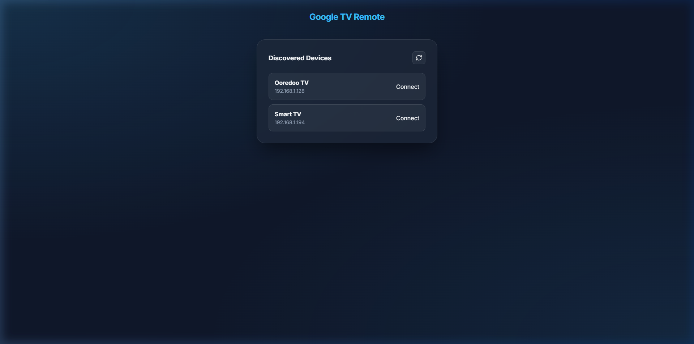
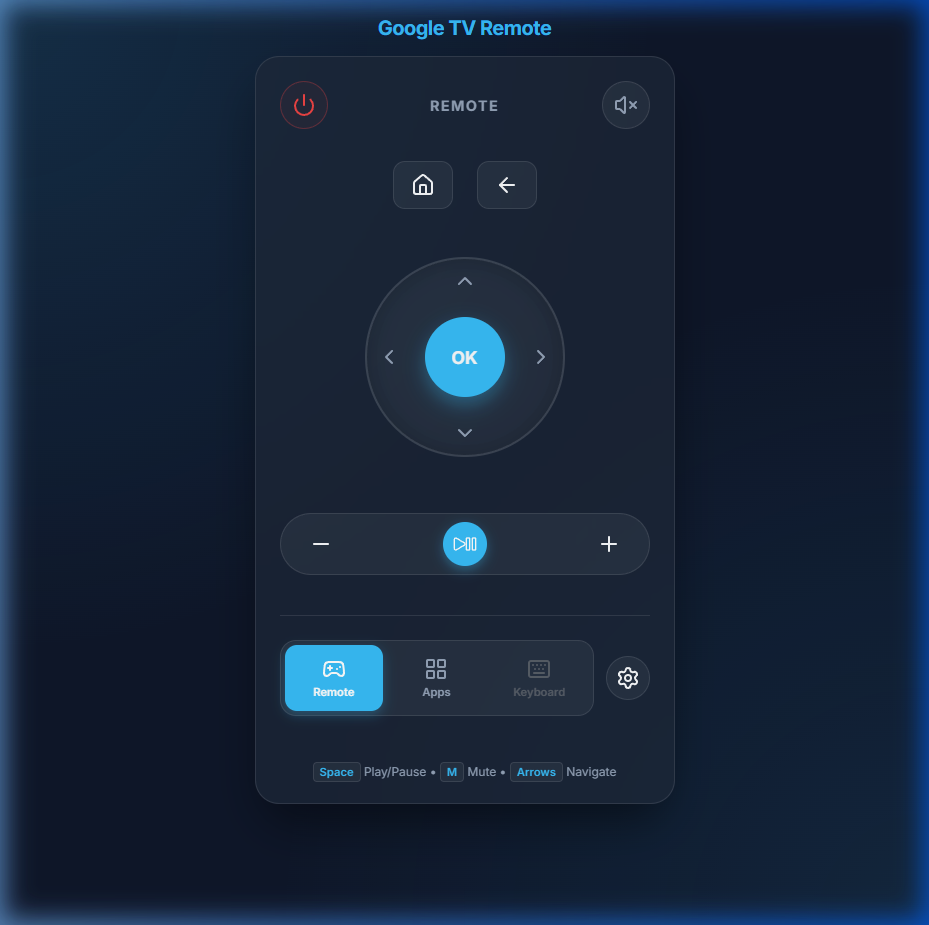
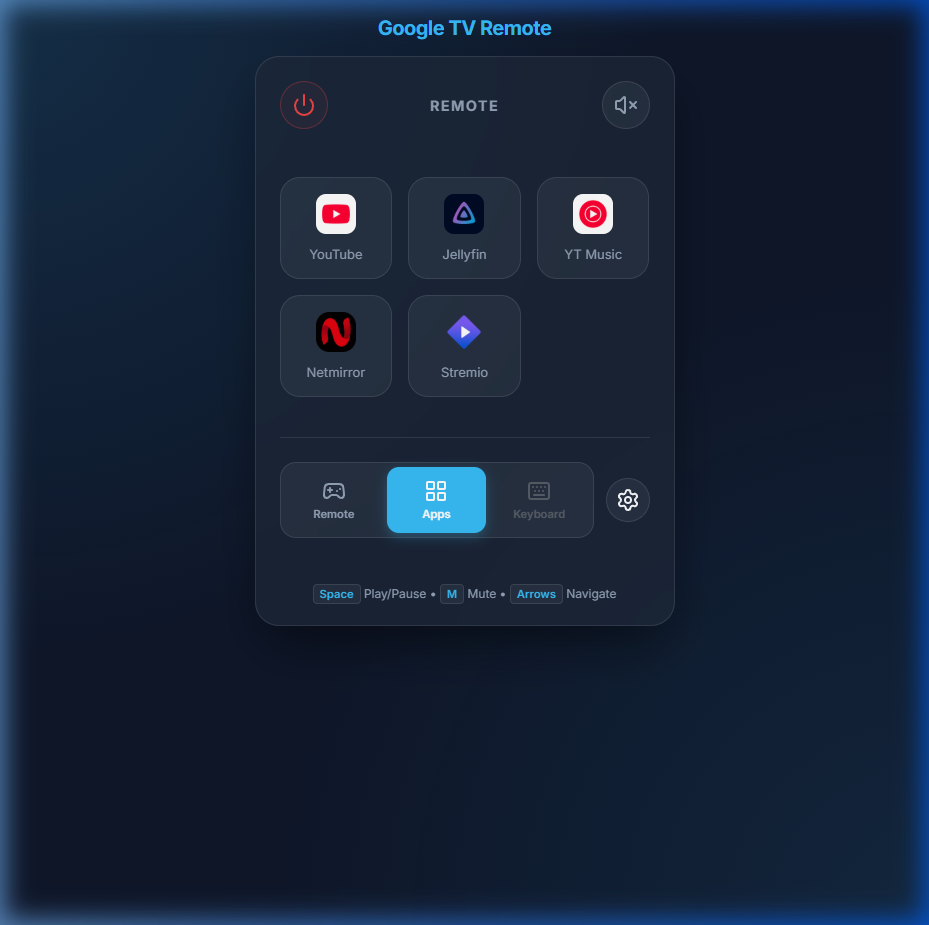

# Google TV Web Remote

A sleek, premium web interface to control your Android TV / Google TV devices.

## Features
- **Device Discovery**: Automatically find compatible TVs on your network.
- **Secure Pairing**: Easy PIN-based pairing.
- **Customizable App Shortcuts**: Dynamic Apps tab allowing you to launch existing apps, add new Android TV packages, or run custom URLs. Core apps (YouTube, Jellyfin, YT Music) are permanent, while others can be managed or deleted.
- **Auto-Connect**: Automatically jumps to the remote if a TV is already paired.
- **Progressive Web App (PWA)**: Install the remote as a native app on your phone or desktop.
- **Keyboard Shortcuts**: Control the TV using your physical keyboard on any tab.

## 📱 Visual Walkthrough

### Discovery Screen


### Remote Controls


### Apps Grid / Manage Apps


## 🧩 App Management
The **Apps Tab** has a dynamic app management system where you can customize your experience:
- **Add New Apps**: Click "Manage Apps" to open the configuration modal. You can add new buttons by supplying the `App Name`, the `Package Name` (e.g., `com.netflix.ninja`) or a direct `Web URL` (e.g., `https://www.netflix.com`), and an `Icon URL` to display.
- **Delete Apps**: You can delete custom apps to declutter your interface. Built-in defaults like Stremio, Netmirror, and On Stream are also removable. 
- **Permanent Apps**: Core ecosystem apps (YouTube, YT Music, Jellyfin) are permanently protected and cannot be deleted.
- **Persistence**: Your customized app list is stored locally in your browser's `localStorage` and will persist across sessions.

## ⌨️ Keyboard & Shortcuts
- **Global Shortcuts**: `Space` (Play/Pause), `M` (Mute), and `Arrows` are active on all tabs.
- **Keyboard Tab**: Currently disabled due to library compatibility issues with native text input. Use physical keyboard shortcuts for navigation and media control.

## 🚀 Auto-Connect Logic
The app uses your browser's local storage to remember the last TV you connected to:
- If a pairing exists, you will land directly on the **Remote** screen.
- To switch devices or pair a new TV, click the **Settings (Gear)** icon at the top right of the remote.

## 📱 PWA Installation
This app is a full **Progressive Web App**. To install it:
- **Android/Chrome**: Tap the menu and select "Install App".
- **iOS/Safari**: Tap the Share button and select "Add to Home Screen".

## Docker Setup (Recommended)

Running in Docker is the easiest way to get the remote up and running. 

### Prerequisites
- Docker installed on your host machine.
- Your computer and TV must be on the same local network.

### 1. Build the image locally
```bash
docker build -t google-tv-remote .
```

### 2. Run the container
> [!IMPORTANT]
> Because the application relies on **mDNS/Zeroconf** for TV discovery, you must use `--network host` mode. Without this, the app will not be able to find any devices on your network.

```bash
docker run -d \
  --name google-tv-remote \
  --network host \
  -v $(pwd)/certs:/app/certs \
  google-tv-remote
```

* `-v $(pwd)/certs:/app/certs`: This ensures your pairing certificates are saved on your computer, so you don't have to re-pair the TV if you restart the container.

### 3. Open the UI
Go to `http://localhost:8504` (or your NAS IP) in your web browser.

### Troubleshooting (Connection Refused)
If the app is running but you cannot reach the UI from your browser:
- Ensure your host firewall allows traffic on port 8504:
  ```bash
  sudo ufw allow 8504/tcp
  ```
- If using Bridge mode, ensure the port mapping is explicitly set to `8504:8504`.

---

## GitHub Container Registry (GHCR)

Alternatively, you can pull the image if you've published it to GHCR:

```bash
docker pull ghcr.io/awaisrafiq410/google-tv-remote:latest
```

## Local Development (Without Docker)

1. **Install Dependencies**:
   ```bash
   py -3.12 -m pip install -r requirements.txt
   ```

2. **Run Server**:
   ```bash
   py -3.12 main.py
   ```
